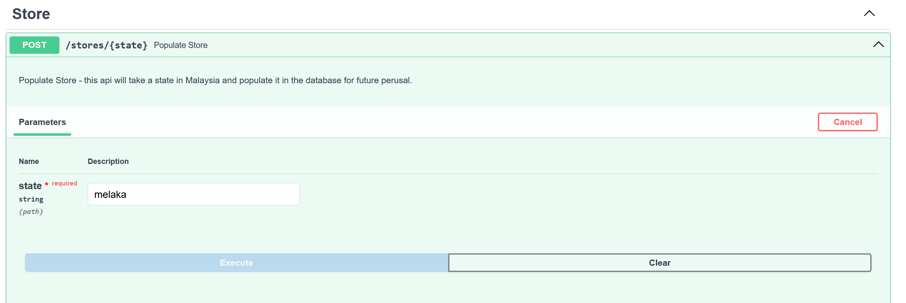
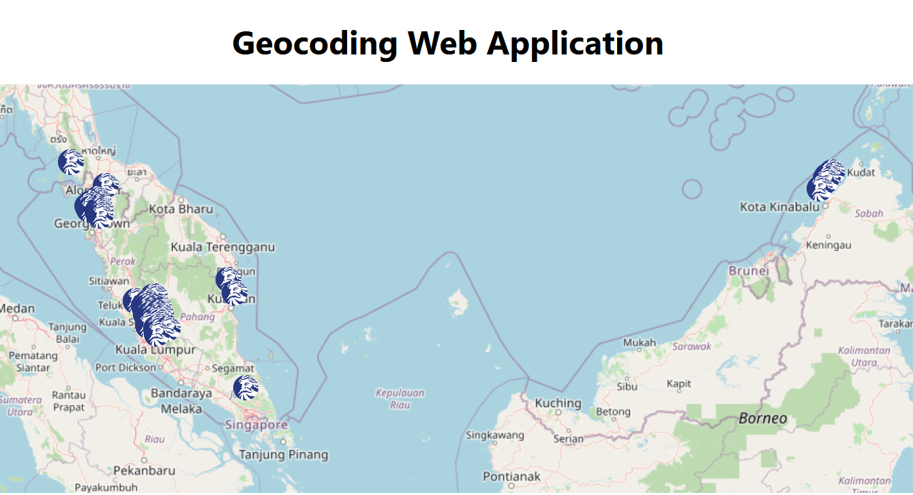
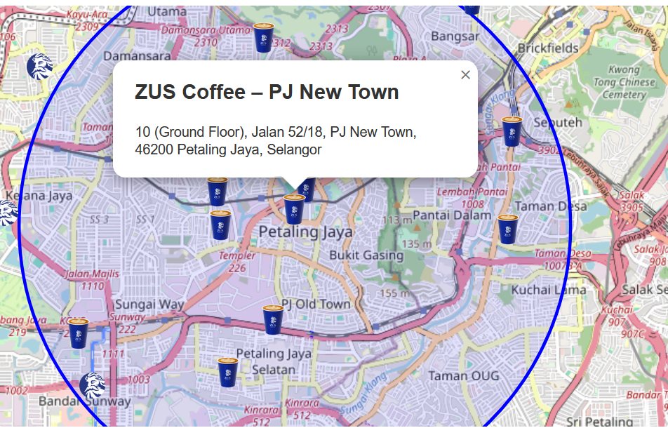

# Geocode Web App
This is a project to scrap data from certain website, geocoding processing the data, and then display it in a map in our frontend.

## 1. Project Structure
backend/  
    src/: Contains FastAPI application code.  
    alembic/: Alembic migration scripts.  
frontend/  
    src/: React application source code.  

## 2. Stack
Frontend: React, leaflet.js (for the map)   
Backend: FastAPI   
Migration Library: alembic   
Web Scraping Library: BeautifulSoup4  
Database: SQLite  

## 3. Installation
venv :````python3 -m venv venv```` create a virtual environment  
python : ````pip install -r requirements.txt```` install all packages from requirements.txt for the backend  
node: npm install in frontend directory

## 4. Running 
### Backend:  
1. cd to backend directory and then run ````uvicorn src.main:app --reload ```` to trigger the backend 
2. create a account in geocode.xyz to get it's authcode.
3. create an .env file that look like this

```ini
GEOCODE_API_AUTHCODE={your authcode here}
```

4. currently the db have only one state (melaka) data
5. you can use this api to add more state, just it in swagger docs after successfully starting the backend http://127.0.0.1:8000/docs


### Frontend
1. npm install 
2. npm start
3. the page will look something like this




## 5. Troubleshooting
Issue: Geocode API errors? The api authcode have some limit for the free tier , but once you reach the limit you can just delete the account and signup another one with a same email.